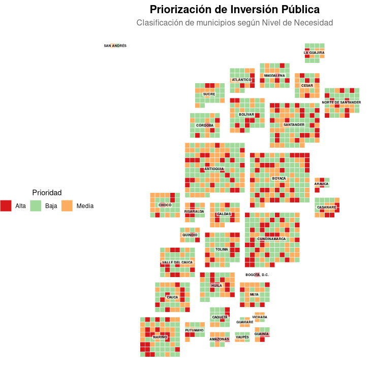

**ColombiaGrid** es un paquete de R diseñado para crear **Tile Grid Maps** (mapas de cuadrículas) de los municipios de Colombia.

A diferencia de los mapas coropléticos tradicionales (geográficos), este tipo de visualización:
1. Evita que los municipios grandes (como los de la Amazonía) dominen visualmente.
2. Permite ver municipios pequeños (como los de Cundinamarca o el Eje Cafetero) con la misma importancia.
3. Es ideal para comparar indicadores de gestión, tasas o categorías.

## Instalación

Puedes instalar la versión de desarrollo desde GitHub usando el paquete `remotes`:

```r
install.packages("remotes")
remotes::install_github("diegodduartebb/ColombiaGrid") 
```

## Uso

La función principal es:
```r
colombia_grid()
```

Para ver la documentación por favor visualizar:
```r
help("colombia_grid")
```

Tip: El paquete devuelve un objeto ggplot2, por lo que puedes seguir añadiendo capas o modificando el tema. Ej:
```r
colombia_grid(mis_datos, "codigo", "valor") +
  theme(legend.position = "top") +
  labs(caption = "Fuente: Datos simulados 2024")
```

Para exportar los mapas generados a un png (o a cualquier formato) lo puede hacer así. Ej:
```r
mi_mapa <- colombia_grid(
  data = mis_datos, 
  value_col = "tasa",
  title = "Mapa de Alta Resolución"
)

ggsave(
  filename = "mapa_hd.png", # Nombre del archivo
  plot = mi_mapa,           # El objeto que creaste
  width = 10,               # Ancho
  height = 12,              # Alto
  units = "in",             # Unidades (pulgadas, cm, mm)
  dpi = 300,                # Resulución
  bg = "white"              # Fondo blanco (evita fondos transparentes por error)
)
```

## Ejemplos

```r
colombia_grid(
  data = datos_conectividad,
  id_col = "cod_dane",
  value_col = "indice",
  scale_type = "continuous",
  title = "Índice de Conectividad Digital 2025",
  subtitle = "Porcentaje de hogares con acceso a fibra óptica (Simulado)",
  legend_title = "Cobertura (%)",
  colors = c("#F0F9E8", "#08589E"),
  text_family = "sans",
  label_size = 1.8,
  label_alpha = 0.7
)
```


```r
colombia_grid(
  data = datos_riesgo,
  id_col = "cod_dane",
  value_col = "nivel",
  scale_type = "discrete",
  title = "Priorización de Inversión Pública",
  subtitle = "Clasificación de municipios según Nivel de Necesidad",
  legend_title = "Prioridad",
  # Diccionario de colores manual (Semáforo de Alerta)
  colors = c("Baja" = "#A1D99B",   # Verde suave
             "Media" = "#FDAE61",  # Naranja
             "Alta" = "#D7191C"),  # Rojo fuerte
  show_labels = TRUE,
  label_color = "black",
  border_color = "white",
  border_size = 0.2
) +
  # Como devuelve un ggplot, podemos mover la leyenda si queremos
  theme(legend.position = "left")
```


